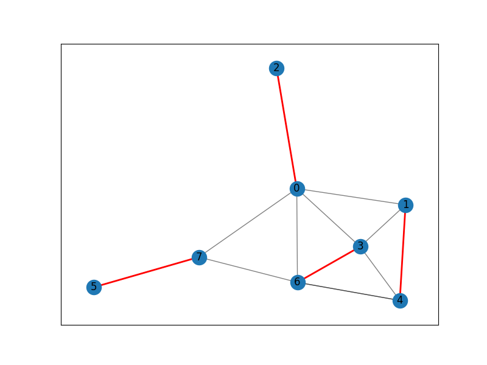
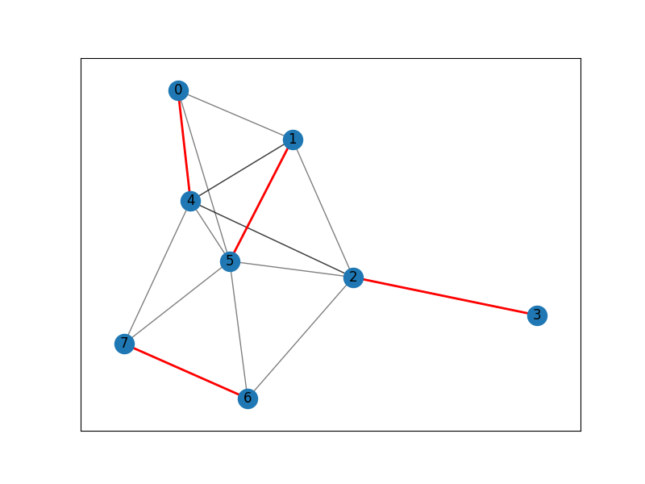

\section*{摘要}
    图的最大匹配问题是图论中的一个经典问题，它的应用非常广泛。本文将基于论文*Paths, Trees, and Flowers*[1]使用C/C++实现一种求解一般图的最大匹配的，复杂度为 $O(|V|^2 * |E|)$ 的带花树算法。

**关键字:** 图论, 最大匹配, 带花树算法

# 对于一般图的最大匹配算法实现

## 问题描述与定义

给定一个图 $G = (V, E)$，求出一个最大的边集$M$，使得$M$是$G$的一个匹配。

## 重要理论基础

### 交错路径与增广路径

1. 交错路径：一条交错路径是一个匹配边和非匹配边上交替出现的路径。
2. 增广路径：一条交错路径，且路径的起点和终点都是未匹配的顶点。

显然，如果存在一条增广路径，那么可以通过将路径上的匹配边和非匹配边交换，从而增加匹配的边数。

我们的思路就是不断遍历所有非匹配点，从而在图中寻找到所有的增广路径，这样就能找到图的最大匹配。

### 问题与解决方案

增广路径的方法有且仅有一个问题：碰到奇环时，不能简单地将路径上的匹配边和非匹配边交换，因为这样会破坏匹配的性质。

这就是带花树算法的核心思想：将图中的所有奇环（"花"）缩成一个点，从而将问题转化为一个二分图的最大匹配问题。

## 核心思路

1. **搜索增广路径**
- 从一个未匹配点出发，使用 BFS/DFS 搜索增广路径。
- 搜索过程中，将点分为两类（层级分割），交替加入“匹配边”和“非匹配边”。
- 如果找到另一未匹配点，则可以形成一条增广路径。

2. **处理奇环（缩环操作）**
- 当在搜索中发现一个奇数环（即 BFS/DFS 遇到一个已经访问过的点，并且两个路径的深度相同），则将其缩成一个点，在缩环后的图中继续搜索增广路径。

- 如果在缩环后的图中找到了增广路径，将该路径还原到原图中。

3. **匹配扩展**
找到增广路径后，通过反转路径中的匹配和非匹配边，扩大匹配。
如果没有找到增广路径，算法终止，当前匹配即为最大匹配。

# C/C++代码实现思路

代码在总体上保持面向对象的思路，力求实现的函数在样式上与数学表达式几乎相同。
因此，我们将实现以下两个类：

1. **Graph**：图的类，用于存储图的信息。
2. **GraphSolver**: 包含图的最大匹配求解算法的类，用于实现带花树算法，包装了所有要用到的参数等。

## 输入输出的约定

在具体探讨如何实现这两个数据结构之前，我们先需给出一种有效的图输入输出方式。

因此我们约定，程序接收的输入格式如下：

**输入格式:**
1. 第一行包含两个整数 $n$ 和 $k$，分别表示图的顶点数和边数。
2. 接下来 $k$ 行，每行包含两个整数 $u$ 和 $v$，表示图中的一条边 $(u, v)$。($1 <= u, v <= n$)

**输出格式:**
1. 输出最大匹配的边数。
2. 接下来 $n$ 行，每行包含一个整数，表示每条匹配上的边的两端点的编号。

因此，主函数的代码如下：

```cpp
int main() {
    cin.tie(0); cout.tie(0); std::ios::sync_with_stdio(0);
    int n, k; cin >> n >> k;
    Graph graph(n);
    for (int i = 0; i < k; ++i) {
        int u, v;
        cin >> u >> v;
        graph.addEdge(u, v);
    }
    GraphSolver solver(graph);
    std::vector<int> matching = solver.findMaximumMatching();
    int matchCount = 0;
    for (int i = 0; i < n; ++i) {
        if (matching[i] != -1 && i < matching[i]) {
            matchCount++;
        }
    }
    cout << "Maximum Matching Size: " << matchCount << "\n";
    for (int i = 0; i < n; ++i) {
        if (matching[i] != -1 && i < matching[i]) {
            cout << i << " " << matching[i] << "\n";
        }
    }
    return 0;
}
```

虽然此处用到了一系列还未定义的类与函数，但是我们可以看到，主函数的代码简洁易懂，只需读入图的信息，调用`GraphSolver`类的函数，然后输出结果即可。下面我们深入探讨此处用到的这些还未定义的类与函数如何实现。

## Graph的数据结构

我们使用邻接表来存储图的信息，这样可以在节省空间的同时方便地遍历图的边。

`Graph` 类的定义如下：

```cpp
class Graph {
private:
    int n; // number of vertices
    std::vector<std::vector<int>> adj; // adjacency list
public:
    Graph(int n);
    void addEdge(int u, int v);
    const std::vector<int>& getNeighbors(int u) const;
    int getNumVertices() const;
};
```

## Graph类的实现

以下是`Graph`类中各函数的具体实现：

```cpp
Graph::Graph(int n) : n(n + 7), adj(n + 7) {}

void Graph::addEdge(int u, int v) {
    adj[u].push_back(v);
    adj[v].push_back(u);
}

const std::vector<int>& Graph::getNeighbors(int u) const {
    return adj[u];
}

int Graph::getNumVertices() const {
    return n;
}
```

函数`addEdge`用于添加一条边，函数`getNeighbors`用于获取一个点的邻居，函数`getNumVertices`用于获取图的顶点数。`Graph`的构造函数中，我们将顶点数加上一个常数，以便在后续的操作中不用担心数组越界，在此处取7。

## GraphSolver的数据结构

我们将`GraphSolver`类定义如下：

```cpp
class GraphSolver {
private:
    const Graph& graph;
    int n;
    std::vector<int> match, base, parent, q;
    std::vector<bool> inQueue, inBlossom;

    int lca(int a, int b);
    void markPath(int u, int b, int child);
    bool findAugmentingPath(int root);

public:
    GraphSolver(const Graph& graph);
    std::vector<int> findMaximumMatching();
};
```

其中每个参数与函数的作用如下：

所有参数如下：

1. graph：存储图的信息。
2. n：图的顶点数。
3. match：匹配向量，match[i]表示顶点i匹配的顶点。
4. base：基向量，base[i]表示顶点i所在的花的基。
5. parent：父节点向量，parent[i]表示顶点i的父节点。
6. q：队列，用于BFS。
7. inQueue：标志向量，inQueue[i]表示顶点i是否在队列中。
8. inBlossom：标志向量，inBlossom[i]表示顶点i是否在花中。

所有函数如下：

1. lca：找到两个点的最近公共祖先。
2. markPath：标记路径。
3. findAugmentingPath：寻找增广路径。
4. GraphSolver：构造函数。
5. findMaximumMatching：核心算法：使用带花树算法寻找最大匹配。

## GraphSolver类的实现

以下是`GraphSolver`类中各函数的具体实现。我们先将`GraphSolver`的构造函数以及辅助函数`lca`, `markPath`, `findAugmentingPath`的实现给出：

### `GraphSolver`构造函数

在构造函数中，我们初始化了所有的参数，包括匹配向量、基向量、父节点向量、队列、标志向量等，并将传入的图信息`graph`保存在自身参数`GraphSolver::graph`中。

```cpp
GraphSolver::GraphSolver(const Graph& graph) 
    : graph(graph), n(graph.getNumVertices()), match(n + 7, -1), base(n + 7), parent(n + 7), inQueue(n + 7), inBlossom(n + 7) {}
```

### `lca`函数

`lca`函数寻咋顶点a和b的最近公共祖先。首先从顶点a开始，沿着匹配边和父节点路径向上走，标记所有经过的顶点。然后从顶点b开始，沿着匹配边和父节点路径向上走，直到找到第一个被标记的顶点，即为最近公共祖先。

```cpp
int GraphSolver::lca(int a, int b) {
    std::vector<bool> mark(n, false);
    while (true) {
        a = base[a];
        mark[a] = true;
        if (match[a] == -1) break;
        a = parent[match[a]];
    }
    while (true) {
        b = base[b];
        if (mark[b]) return b;
        b = parent[match[b]];
    }
}
```

### `markPath`函数

`markPath`函数用于在找到奇环时标记路径。它会从顶点u开始，沿着匹配边和父节点路径向上走，直到到达基b，并标记路径上的所有顶点。具体实现如下：

```cpp
void GraphSolver::markPath(int u, int b, int child) {
    for (; base[u] != b; u = parent[match[u]]) {
        inBlossom[base[u]] = inBlossom[base[match[u]]] = true;
        parent[u] = child;
        child = match[u];
    }
}
```

### `findAugmentingPath`函数

`findAugmentingPath`函数用于寻找增广路径。它会从顶点root开始，使用BFS搜索增广路径。鉴于该函数为带花树算法的核心，我们将其分为几个部分详细介绍：

1. *初始化*：初始化队列、父节点和基向量，并将根节点加入队列。

```cpp
    inQueue.assign(n, false);
    parent.assign(n, -1);
    for (int i = 0; i < n; ++i) base[i] = i;
    q.clear();
    q.push_back(root);
    inQueue[root] = true;
```

2. *BFS搜索*：使用BFS从根节点开始搜索增广路径。

```cpp
    for (size_t qi = 0; qi < q.size(); ++qi) {
        int v = q[qi];
        for (int u : graph.getNeighbors(v)) {
            if (base[v] == base[u] || match[v] == u) continue;
            ...
```

3. *处理邻居节点*：对于每个邻居节点u，如果u是根节点或已经在路径中，则找到最近公共祖先并标记路径；否则，如果u没有父节点，则更新父节点并继续搜索。

从实现的角度看，我们实际上并不需要真的收缩奇环，只需要在找到奇环时标记路径即可。因此，我们在找到奇环时，将路径上的所有顶点都标记为在花中，然后将花中的所有顶点的基向量更新为当前花的基。

```cpp
            ...
            if (u == root || (match[u] != -1 && parent[match[u]] != -1)) {
                // blossom found, contract it
                int curBase = lca(v, u);
                inBlossom.assign(n, false);
                markPath(v, curBase, u);
                markPath(u, curBase, v);
                for (int i = 0; i < n; ++i) {
                    if (inBlossom[base[i]]) {
                        base[i] = curBase;
                        if (!inQueue[i]) {
                            inQueue[i] = true;
                            q.push_back(i);
                        }
                    }
                }
            } else if (parent[u] == -1) {
                // u is free, add it to the queue
                parent[u] = v;
                if (match[u] == -1) {
                    // found augmenting path
                    int d = u;
                    while (d != -1) {
                        int pv = parent[d];
                        int pp = match[pv];
                        match[d] = pv;
                        match[pv] = d;
                        d = pp;
                    }
                    return true;
                } else {
                    // u is matched, add its match to the queue
                    inQueue[match[u]] = true;
                    q.push_back(match[u]);
                }
            }
        }
    }
```

4. *找到增广路径*：如果找到增广路径，则更新匹配并返回true；否则，继续搜索。若搜索完毕仍未找到增广路径，则返回false。

```cpp
    ...
    return false;
}
```

完整的`findAugmentingPath`函数实现如下：

```cpp
bool GraphSolver::findAugmentingPath(int root) {
    inQueue.assign(n, false);
    parent.assign(n, -1);
    for (int i = 0; i < n; ++i) base[i] = i;
    q.clear();
    q.push_back(root);
    inQueue[root] = true;

    for (size_t qi = 0; qi < q.size(); ++qi) {
        int v = q[qi];
        for (int u : graph.getNeighbors(v)) {
            if (base[v] == base[u] || match[v] == u) continue;
            if (u == root || (match[u] != -1 && parent[match[u]] != -1)) {
                int curBase = lca(v, u);
                inBlossom.assign(n, false);
                markPath(v, curBase, u);
                markPath(u, curBase, v);
                for (int i = 0; i < n; ++i) {
                    if (inBlossom[base[i]]) {
                        base[i] = curBase;
                        if (!inQueue[i]) {
                            inQueue[i] = true;
                            q.push_back(i);
                        }
                    }
                }
            } else if (parent[u] == -1) {
                parent[u] = v;
                if (match[u] == -1) {
                    int d = u;
                    while (d != -1) {
                        int pv = parent[d];
                        int pp = match[pv];
                        match[d] = pv;
                        match[pv] = d;
                        d = pp;
                    }
                    return true;
                } else {
                    inQueue[match[u]] = true;
                    q.push_back(match[u]);
                }
            }
        }
    }
    return false;
}
```

### `findMaximumMatching`函数

在实现了`findAugmentingPath`后，我们距离完整的带花树算法只差一步之遥：`findMaximumMatching`函数将不断搜索增广路径，直到找不到增广路径为止。这样，我们就实现了完整的带花树算法，找到了图的最大匹配。

```cpp
std::vector<int> GraphSolver::findMaximumMatching() {
    for (int i = 0; i < n; ++i) {
        if (match[i] == -1) {
            findAugmentingPath(i);
        }
    }
    return match;
}
```

# 挑战问题的实现

在这一部分，我们将基于带花树算法，设计更快速的并行算法来解决最大匹配问题。


# 额外功能：可视化结果

## 绘制结果：python代码实现

为了更好地展示算法的结果，我们可以将图画出，并将最大匹配的边在图上标记出来。我们可以使用python的`matplotlib`与`networkx`库来实现这一功能。以下的代码位于根目录的`driver.py`文件中：

```python
import datetime
import subprocess
import random
import networkx as nx
import matplotlib.pyplot as plt
import os

def main():
    num_vertices = random.randint(5, 10)
    num_edges = random.randint(num_vertices - 1, num_vertices * (num_vertices - 1) // 2)
    edges = set()

    while len(edges) < num_edges:
        u = random.randint(0, num_vertices - 1)
        v = random.randint(0, num_vertices - 1)
        if u != v:
            edges.add((u, v))

    input_data = f"{num_vertices} {len(edges)}\n"
    for u, v in edges:
        input_data += f"{u} {v}\n"

    process = subprocess.Popen(
        ['build/graph_max_matching.exe'],
        stdin=subprocess.PIPE,
        stdout=subprocess.PIPE,
        stderr=subprocess.PIPE,
        text=True
    )
    stdout, stderr = process.communicate(input=input_data)

    matching = []
    lines = stdout.strip().split('\n')
    for line in lines[1:]:
        tokens = line.strip().split()
        if len(tokens) == 2:
            u, v = map(int, tokens)
            matching.append((u, v))

    G = nx.Graph()
    G.add_nodes_from(range(num_vertices))
    G.add_edges_from(edges)

    pos = nx.spring_layout(G)
    plt.figure(figsize=(8, 6))

    nx.draw_networkx_edges(G, pos, edgelist=edges, width=1.0, alpha=0.5)
    nx.draw_networkx_edges(G, pos, edgelist=matching, width=2.0, edge_color='r')
    nx.draw_networkx_nodes(G, pos, node_size=300)
    nx.draw_networkx_labels(G, pos)

    date_time = datetime.datetime.now().strftime("%Y%m%d%H%M%S")
    os.makedirs('output_img', exist_ok=True)
    plt.savefig(f'output_img/{date_time}.png')
    plt.show()

if __name__ == '__main__':
    main()
```

在这段代码中，我们首先生成一个随机图，然后调用编译好的C/C++程序来求解最大匹配；最后，我们使用`networkx`与`matplotlib`库将图画出，并将最大匹配的边标记为红色。最终的结果将保存在`output_img`文件夹中，文件名为日期/时间，以确保每张图的文件名均不同。

## 样例图

以下为两张样例图：




从图中我们可以直观地看到：我们实现的带花树算法得到了正确的最大匹配。

# 总结


# 参考文献

[1] Edmonds J. Paths, Trees, and Flowers. Canadian Journal of Mathematics. 1965;17:449-467. doi:10.4153/CJM-1965-045-4
